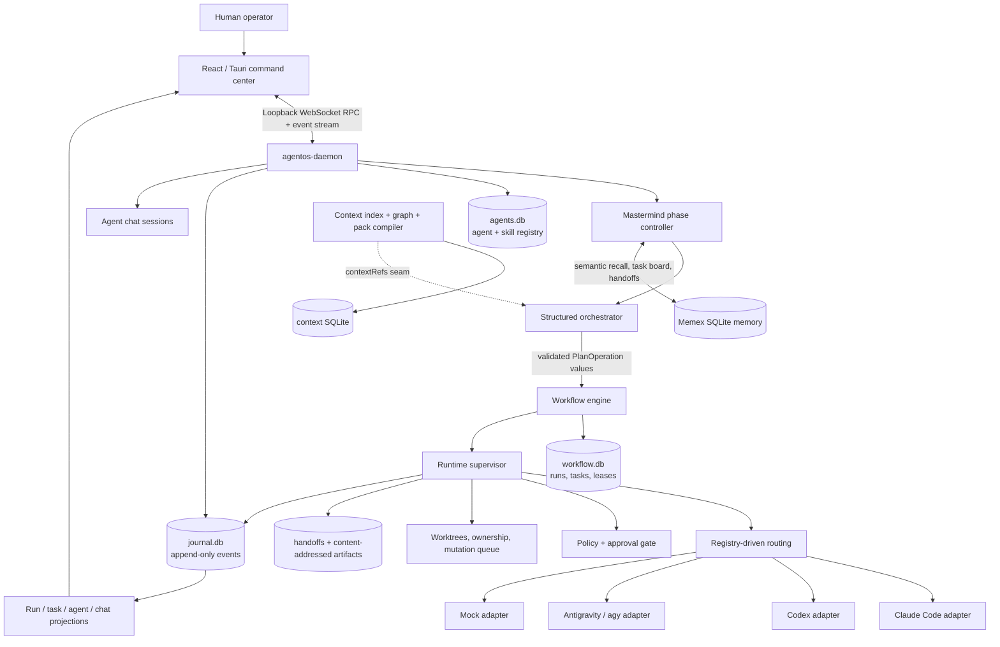

# Agent Engineering OS

> A local-first, multi-provider operating system for planning, supervising, reviewing, recovering, and auditing teams of AI coding agents.

Agent Engineering OS turns a software goal into a governed workflow instead of handing an entire repository to one unconstrained model. A planning agent produces structured operations; a deterministic Rust engine validates them into a directed acyclic graph; registry-selected workers execute bounded tasks through Claude Code, Codex, Antigravity/agy, or a billing-free mock adapter; reviewers and humans gate progression; and every important transition is written to durable local state.

The project includes:

- a Rust daemon and WebSocket API;
- a versioned, durable DAG workflow engine;
- provider adapters for Claude Code, Codex, Antigravity/agy, and mock execution;
- a dynamic SQLite-backed agent and skill registry;
- a Mastermind workflow that takes a project through discovery, specifications, design, implementation, review, and final verification;
- cross-provider semantic memory through Memex;
- an append-only event journal and replayable UI projections;
- policy, approval, secret, ownership, worktree, and Git mutation controls;
- a React + TypeScript command center with an optional Tauri desktop shell.

This repository is an active, experimental engineering system. It already has extensive automated coverage and has completed live multi-agent runs, but the [known limitations](#known-limitations-and-honest-status) matter if you intend to use it on valuable repositories.

## Contents

- [Why this exists](#why-this-exists)
- [Core invariants](#core-invariants)
- [System architecture](#system-architecture)
- [How orchestration works](#how-orchestration-works)
- [How memory works](#how-memory-works)
- [Provider adapters](#provider-adapters)
- [Agent and skill registry](#agent-and-skill-registry)
- [Workflow engine](#workflow-engine)
- [Runtime supervisor](#runtime-supervisor)
- [Policy and security](#policy-and-security)
- [Git isolation and mutation flow](#git-isolation-and-mutation-flow)
- [Daemon and WebSocket API](#daemon-and-websocket-api)
- [Desktop command center](#desktop-command-center)
- [Repository map](#repository-map)
- [Getting started](#getting-started)
- [Configuration](#configuration)
- [Testing](#testing)
- [Failure and recovery model](#failure-and-recovery-model)
- [Known limitations](#known-limitations-and-honest-status)

## Why this exists

Most coding-agent tools collapse planning, execution, authorization, memory, and source-control mutation into one model conversation. That is convenient, but it makes several hard problems invisible:

- Who is allowed to change which files?
- What happens when two agents try to edit overlapping paths?
- Can a model invent a worker, dependency, or state transition?
- How is completed work recovered after a provider outage?
- How does a reviewer receive outputs without replaying an enormous transcript?
- Which human approval authorized a particular operation?
- Can the system restart without forgetting leases, attempts, decisions, or task state?
- Can models from different providers share project memory without provider-specific chat history?

Agent Engineering OS treats those questions as systems problems. Models propose and perform bounded work; deterministic components own state, validation, permissions, persistence, and mutation.

## Core invariants

The implementation is organized around a small set of non-negotiable rules.

1. **Models propose; deterministic code mutates state.** The orchestrator emits a closed vocabulary of structured plan operations. It does not write workflow rows directly.
2. **The workflow engine owns lifecycle legality.** DAG validation, dependency readiness, task transitions, leases, retries, and budgets are enforced outside prompts.
3. **The journal is append-only.** Corrections are new events. SQLite triggers reject updates and deletes to historical event rows.
4. **Workers receive scoped contracts.** Objectives, allowed paths, forbidden paths, dependencies, checks, budgets, base commits, and Git policy are explicit data.
5. **Deny beats allow.** Registry settings can narrow policy-compiled permissions but cannot widen them.
6. **Git mutations are centralized.** Workers do not directly commit or push when `no-direct-git` is active; governed mutations flow through the Git manager.
7. **Approvals bind to exact operations.** A changed operation has a different fingerprint and is not covered by an earlier approval.
8. **Provider failure is typed.** Authentication, quota, transient transport, reasoning failure, timeout, denial, and process crashes are not treated as the same event.
9. **Recovery is explicit.** The scheduler never silently resurrects a terminally failed task. An operator may reopen a failed run after the underlying cause has cleared.
10. **Memory has multiple roles.** Chronology, semantic recall, workflow state, checkpoints, context caches, chat history, and artifacts are stored separately because they have different consistency and retention needs.

## System architecture



The separation is intentional:

- the daemon is the local control plane;
- the orchestrator decides what should be attempted;
- the workflow engine decides what is structurally and temporally legal;
- the supervisor composes execution services;
- adapters translate one provider’s CLI protocol into common session events;
- the registry decides which provider, model, skills, and mode belong to a role;
- policy decides which capabilities and operations are authorized;
- the journal records what happened;
- projections render current state from history;
- Memex supplies shared semantic memory across provider boundaries.

## How orchestration works

### 1. Mastermind controls the project lifecycle

The daemon’s `Mastermind` service is a durable, phase-gated project workflow. Its canonical phases are:

| Phase | Output or purpose |
|---|---|
| 0 — Setup | Validate the repository and initialize the session. |
| 1 — Discovery | Interview the user and freeze product decisions. |
| 2 — Product requirements | Produce the PRD from approved discovery. |
| 3 — Feature specifications | Split the product into detailed feature contracts. |
| 4 — Implementation plan | Define sequencing and deliverables. |
| 5 — API record | Verify external APIs and record facts that must not be guessed. |
| 6 — Design | Produce the design system and frontend rules. |
| 7 — Mockups | Produce high-fidelity UI mockups. |
| 7.5 — HTML to React | For React stacks, convert approved mockups into generated components under a derived write scope. |
| 8 — Build | Ask the orchestrator for a worker DAG, commit it, and drive execution. |
| 9 — Wrap | Run final review and verification. |
| Complete | Terminal phase after the final human gate. |

Each authored phase follows a guarded cycle:

```text
read-only preparation
        ↓
human authorizes the exact write scope
        ↓
scoped authoring turn
        ↓
independent review
        ↓
PASS ──► human approval ──► next phase
 FAIL ─► revision guidance / retry / explicit accept-as-is
```

The write authorization is separate from final artifact approval. This makes “the model may write these paths” different from “the human accepts what was written.” Phase checkpoints are atomically published under the daemon state directory, so a daemon restart can restore the session, selected planner, provider conversation handle, approved phases, phase status, write scope, and orchestrator checkpoint.

### 2. The planning model has a closed command language

The orchestrator accepts six operation types:

| Operation | Effect |
|---|---|
| `create_task` | Add a workflow node with type, dependencies, pool, objective, priority, budgets, and retry policy. |
| `add_dependency` | Add one dependency edge before materialization. |
| `assign_pool` | Route an uncommitted node to an enabled registry pool. |
| `request_review` | Add a downstream review node for a task. |
| `escalate` | Raise priority and, when configured, retarget or request human intervention. |
| `close_goal` | Request closure after the engine reports terminal success. |

Provider output parsing is total: fenced JSON, bare arrays, envelopes, individual objects, and JSON lines are recognized; malformed or unknown values become machine-readable rejections rather than disappearing. Rejections include corrective hints and are fed into the next planning snapshot.

The plan remains a draft until an explicit commit. On commit, the sink compiles `NodeSpec` values, synthesizes complete task contracts, and asks the workflow engine to materialize the run. The model never receives a raw database mutation primitive.

### 3. Engine validation is authoritative

Before a plan can run, the workflow engine checks:

- the graph is non-empty;
- node IDs are unique;
- every dependency exists;
- the graph is acyclic;
- loop nodes have an explicit positive bound;
- node and contract data serialize into the canonical types.

A cycle is rejected with the actual cycle path. Live replanning may append new nodes transactionally, but it cannot rewrite a node that may already be leased. The tentative graph is validated inside the write transaction, preventing concurrent appends from jointly introducing an invalid graph.

### 4. Registry descriptions become the routing table

The planning snapshot contains the enabled worker roster: stable agent ID, name, description, adapter, and model. The planner must choose a real ID from this roster. Invented pools are rejected.

At execution time the supervisor resolves the task’s `agent_role` through the same registry. The resolved record selects:

- provider adapter;
- model slug;
- reasoning effort where supported;
- plan or edit mode;
- assigned skill bodies;
- tool allowlist and denylist;
- timeout;
- enabled/disabled state.

If registry lookup fails during a run, the runtime can fall back to explicitly configured static routing and logs the degradation. A corrupt registry at startup is treated as a hard error because silent misrouting is worse than refusing to start.

### 5. The supervisor executes, but does not reschedule

The supervisor is the composition root around the workflow engine. It does not invent a second scheduler. For a normal write-capable task it performs this pipeline:

```text
budget pre-check
  → acquire path ownership
  → select shared checkout or isolated worktree
  → resolve registry agent
  → compose skills + objective
  → compile policy into spawn constraints
  → start provider session
  → relay typed events and heartbeats
  → meter usage
  → validate the final HandoffPacket
  → persist packet/artifact references
  → release ownership
  → let the engine record the outcome
```

Review, parallel, human-approval, and Git-gate nodes use specialized execution paths rather than pretending every node is a coding session.

### 6. Reviews and humans are first-class gates

The code reviewer is a registry agent. Review responses fail closed unless the first canonical verdict line is `VERDICT: PASS`. A later incidental phrase containing “verdict: pass” does not override an opening failure.

Most reviews are read-only and shell-less. Phase 9 is intentionally different because its deliverable is fresh execution evidence: that reviewer receives command capability and repository scope so it can run the required build and tests. This broader capability is limited to the wrap phase.

Human approvals are durable records, not text in a prompt. A pending approval parks a task in `HumanRequired` without consuming an attempt. Approval, denial, expiry, and operation mutation are distinct results.

### 7. Provider failover is narrow and explicit

The Mastermind planner only fails over automatically when an adapter reports a typed provider quota/rate-limit condition. It does not spend money on another provider merely because a model returned a generic error, timed out, failed authentication, or produced bad reasoning. The provider conversation is reset when switching providers, while the durable phase state and Memex memory remain available.

## How memory works

“Memory” is not one database in this project. It is a layered system in which each store answers a different question.

| Layer | Storage | What it remembers | Why it exists |
|---|---|---|---|
| Event memory | `journal.db` | The ordered facts of what happened. | Audit, replay, projections, chat reconstruction, recovery diagnostics. |
| Workflow memory | `workflow.db` | Runs, tasks, states, dependencies, priorities, leases, heartbeats, attempts, budgets, and contracts. | Deterministic restart and scheduling. |
| Mastermind checkpoints | `state/mastermind/<session>/checkpoints/*.json` | Phase, approvals, planner/provider selection, discovery answers, write scope, plan checkpoint, and provider conversation handle. | Restore the control session after daemon restart. |
| Semantic project memory | Memex SQLite database | Decisions, approved phase snapshots, verified API facts, revisions, lessons, task board rows, and cross-agent handoffs. | Cross-provider recall without depending on a provider’s private transcript. |
| Context memory | `agentos-context` SQLite store | File hashes, provenance, context graph nodes, dependency dirtiness, symbols, summaries, and decision references. | Reusable, invalidatable context packs for bounded prompts. |
| Agent memory | `agents.db` | Agent definitions, model routing, skills, modes, tools, and enabled state. | Runtime-editable organizational knowledge. |
| Artifact memory | `state/.../handoffs` and `artifacts` | Validated handoff packets and content-addressed payloads. | Pass compact references instead of replaying full transcripts. |
| Chat memory | Folded from `journal.db` | User turns, final agent turns, decisions, failures, provider session IDs. | Reloadable and resumable chat history. |

### Semantic memory through Memex

`MemexClient` is a thin provider-neutral bridge to the local `memex` CLI. AgentOS deliberately does not duplicate Memex’s schema. Claude, Codex, Gemini-backed agy sessions, and the daemon share the same project key and database contract.

The project key is derived from the canonical repository path and prefixed with `agentos:`. Windows paths are normalized to forward slashes and case-folded, so different provider processes address the same project memory.

At phase boundaries Mastermind writes structured records such as:

- discovery questions and approved answers;
- one approved phase snapshot per phase;
- the verified API record;
- explicit revision decisions that supersede earlier guidance;
- lessons connecting a failed review to its resolution;
- imported legacy memory from `docs/memory/MEMORY.md`, `HANDOFF.md`, or `RESUME.md`;
- task board status for planned and running nodes;
- handoffs from the approved phase to the next phase’s agent;
- references to accepted runtime `HandoffPacket` values.

Memex writes are append-oriented. During recall, replaceable facts are reduced to their newest effective record:

- newest phase snapshot per phase;
- newest approved decision per phase and decision ordinal;
- newest decision revision per phase;
- newest legacy import per source path.

Lessons, API facts, and unrelated context remain additive. This gives corrected decisions “last effective value” behavior without rewriting history.

### Prompt recall and budgeting

Before a planning or phase turn, Mastermind searches the current project for up to 32 `mastermind` records, filters them to the active session, reduces superseded projections, and applies a character budget:

- maximum 24,000 characters of semantic memory in a prompt;
- maximum 6,000 characters from any individual record;
- newest records first;
- a visible truncation marker when a record is shortened.

The prompt cache is not considered the source of truth. Approved repository documents, the current workflow snapshot, the canonical live skill, and the Memex board are supplied separately. The envelope labels state as data so stored text is not silently promoted into executable instructions.

### Task board and handoffs

Memex’s task board mirrors plan and run state using session-qualified task IDs. Phase approval creates a handoff naming the next phase agent and the approved artifacts. Runtime handoff packets are represented in Memex by references such as `agentos-handoff:<id>` rather than embedding the full payload.

This separates coordination metadata from the authoritative task store:

- `workflow.db` decides whether a task is runnable;
- Memex helps agents and humans understand what exists, who owns it, and what was handed off.

### Append-only journal memory

The event journal is the chronological system of record. Each event has a UUID, event type, timestamp, optional run/trace/task/agent identifiers, JSON payload, optional payload reference and hash, and schema version. The database assigns a monotonically increasing `seq` used for replay and subscriptions.

Large payloads are offloaded. The event stores `null` inline plus a content reference and integrity hash. Unknown future event types survive round trips through `EventType::Other`, allowing older readers to preserve newer events.

The journal uses SQLite WAL, a five-second busy timeout, explicit `BEGIN IMMEDIATE` writes, and storage-level triggers that reject `UPDATE` and `DELETE`.

### Chat history as a projection

Live chat messages are not a separate mutable transcript database. The daemon folds chat-marked journal events into session summaries and transcripts:

- `session.spawn` establishes provider, model, agent, and time;
- `session.started` records the provider-side resume handle;
- `session.instruction` is a user message;
- `session.finished` contributes the final agent response;
- `agent.decision` preserves a question and its options;
- failure and cancellation events explain termination.

Worker sessions use much of the same event vocabulary but omit `chat: true`, so they do not leak into human chat history.

### Context graph and invalidation

`agentos-context` provides a separate memory subsystem for source context:

1. The file index walks deterministically and hashes eligible files with BLAKE3.
2. Incremental rescans use size and modification time only as a fast path.
3. `verify_all` rehashes everything and catches same-size, restored-mtime changes.
4. Context nodes store mandatory file/hash provenance, symbols, dependencies, summaries, decisions, and versions.
5. A changed source file marks its sourcing nodes `direct-dirty` and transitive dependents `dependency-dirty`.
6. Sticky `needs-review` state requires explicit clearance.
7. The pack compiler ranks scoped files, referenced node summaries, source files, dependency summaries, and decision refs under a strict estimated token budget.
8. The output is an ephemeral Markdown context pack plus a structured manifest of included and omitted chunks.

The current symbol extractor is deliberately a lightweight line scanner, with a clear seam for tree-sitter. Context references exist in orchestrator snapshots, but full automatic context-pack injection into Mastermind planning is not yet wired.

## Provider adapters

Every provider implements the same `RuntimeAdapter` boundary:

- `detect()` reports runtime, version, auth, and capabilities;
- `start_session(SpawnSpec)` returns a cancellable session handle;
- the session broadcasts normalized `AdapterEvent` values;
- `send()` resumes or continues a supported provider conversation;
- `cancel()` terminates the provider process.

### Common spawn contract

A `SpawnSpec` carries task/session identity, objective, working directory, model, timeout, isolated home, allowed and forbidden paths, and tool allow/deny lists. Adapters translate those values into their own CLI arguments and sandbox semantics.

### Common event vocabulary

Adapters normalize provider output into events such as:

- `Started`;
- `TextDelta`;
- `ToolUse`;
- `DecisionRequired`;
- `RateLimit`;
- `UsageUpdate`;
- `Finished`;
- `Failed` with a classified failure.

The runtime journals control and telemetry events but does not journal every text delta. Full transcripts remain available through provider session references where supported.

### Implementations

| Adapter | ID | Execution model | Notes |
|---|---|---|---|
| Claude Code | `claude-code` | Headless CLI session with streamed JSON. | Supports resume, tool policy flags, usage parsing, and a fixed per-session overhead accounting line. |
| Codex | `codex` | `codex exec` JSON stream. | Maps sandbox modes, thread IDs, tool events, usage, and failures into the shared protocol. |
| Antigravity/agy | `antigravity-agy` | `agy run` in plan or accept-edits mode. | Supports model catalog probing, conversation continuation, quota parsing, structured results, and virtualized write scopes. |
| Mock | `mock` | In-process scripted session. | Drives deterministic tests and UI demos without credentials or billing. |

Provider result schemas drift. Reducers therefore parse defensively, preserve useful final results, and classify explicit error payloads separately from successful exit-zero results. The adapter layer also recognizes interactive decision shapes and converts them into a provider-neutral decision event.

## Agent and skill registry

Agents are data, not Rust match arms. `agents.db` stores `AgentRecord` rows with:

- stable slug ID;
- display name and routing description;
- adapter ID and optional model;
- reasoning effort;
- `plan` or `accept_edits` mode;
- assigned skill IDs;
- tool allowlist and denylist;
- timeout;
- enabled and built-in flags;
- creation and update timestamps.

Skills are Markdown records with an ID, name, description, body, and built-in flag. `preamble_for()` resolves assigned skills and composes the prompt preamble. Global communication and implementation disciplines are injected consistently so fallback routes do not silently lose baseline behavior.

Built-in agents are editable but cannot be deleted. Seeding is insert-if-absent, which preserves local customization across daemon restarts. User-created records may be created, updated, enabled, disabled, and deleted through the WebSocket API and desktop UI.

The registry includes planning, creation, research, design, review, testing, database, DevOps, security, debugging, documentation, and stack-specialist roles. Exact provider/model assignments are seed data in `crates/agentos-agents/src/seeds.rs`, not architectural constants; edit the registry to fit your installed providers and account limits.

Agent Creator sessions may emit fenced JSON proposals. The daemon validates the draft and journals `agent.proposal`, but does not register it. A human must explicitly invoke registry creation.

## Workflow engine

### Node types

| Type | Meaning |
|---|---|
| `run` | Perform a normal bounded task. |
| `parallel` | Synchronization/fan-out node; dependencies provide the concurrency semantics. |
| `review` | Review upstream handoffs. |
| `git_gate` | Govern a centralized Git mutation. |
| `human_approval` | Park until a durable human decision exists. |
| `branch` | Execute a branch-oriented task. |
| `loop { maxIterations }` | Execute bounded iterative work. |

### Task lifecycle

The core state machine contains more detail than “todo/running/done”:

```text
Created → Planned → Ready → Leased → Running
                                   ├─ failure → Retryable → Ready | Failed
                                   ├─ human gate → HumanRequired
                                   └─ success → OutputReady
                                               → ReviewPending
                                               → Approved
                                               → GitQueued
                                               → Committed
                                               → Done
```

Blocked, failed, cancelled, and human-required paths are explicit. State changes use compare-and-swap SQL updates and call the core transition rules before mutation.

### Scheduling

A tick performs:

1. reclaim expired leases;
2. promote dependency-satisfied tasks;
3. apply budget gates and grant leases;
4. transition leased tasks to running and execute them concurrently;
5. record outcomes with compare-and-swap transitions;
6. refresh run status.

Ready tasks are ordered by priority (`P0` first), then age, then ID. Dependency gates allow independent ready nodes to run in parallel. Path ownership may still serialize tasks whose write scopes overlap.

### Leases and crash recovery

Leases persist owner, expiry, and heartbeat. A heartbeat renews using the originally granted TTL. A foreign owner cannot heartbeat another task. Expired `Leased` tasks return to `Ready`; expired `Running` tasks travel through the retry path. The abandoned attempt is counted.

Because leases and attempts are durable, dropping and reopening the engine does not erase in-flight state. Restart tests cover continuing from a mid-run database.

### Budgets and retries

Each node can bound:

- maximum attempts;
- maximum elapsed seconds;
- maximum cost in USD;
- transient retries;
- reasoning retries.

The budget gate runs before each lease. Usage updates can also trip the supervisor’s mid-session cost gate. Unknown cost data does not fabricate a breach. Waiting for a human does not consume an attempt.

## Runtime supervisor

`agentos-runtime` binds all execution concerns together:

- workflow engine and store;
- adapter registry;
- agent registry overlay;
- task contracts;
- permission compilation;
- worktree manager;
- ownership map;
- serialized mutation queue;
- agent/commit ledger;
- usage ledger;
- approval and audit stores;
- journal appends;
- handoff and artifact persistence;
- optional code-graph refresh.

### Task contracts

A runtime `TaskContract` includes version, ID, objective, allowed and forbidden paths, dependencies, context references, acceptance criteria, required checks, minute/attempt budgets, base commit, expected artifacts, and Git policy.

The executor clones the contract at lease time. Downstream spawn, review, and gate behavior uses that snapshot. Contract changes therefore create a new version rather than mutating the instructions beneath a running attempt.

### Handoff packets

Workers finish with a typed `HandoffPacket`, not an unstructured “done” string. The packet records:

- producing agent and task;
- closed status set;
- summary;
- files changed;
- artifact references;
- context references and decisions;
- structured test results;
- unresolved items;
- requested next action;
- optional transcript reference.

Inline artifact bodies and data URIs are rejected. Accepted packets are stored and referenced by hash. Reviewers receive bounded outputs rather than entire provider conversations.

### Usage accounting

The usage ledger records task and per-model token counts, cost where supplied, and provider session overhead. Status becomes warning at 80% of a configured ceiling and exceeded at the ceiling. Run totals aggregate task usage.

## Policy and security

`agentos-policy` is a deterministic governance layer.

### Permissions

`PermissionSet` independently controls:

- readable path globs;
- writable path globs;
- shell mode;
- network policy;
- Git actions;
- secret scopes;
- tool allowlist;
- approval requirements.

Empty/default wire values fail closed. Write does not imply read. Tool allowlists narrow capability, and denylists win. Worker presets do not receive Git actions because the Git manager owns mutations.

### Approval fingerprints

Approval requests bind a gate to canonical JSON describing an operation. Object keys are sorted recursively; arrays remain order-sensitive. The current change-detection fingerprint is prefixed FNV-1a 64-bit. It is suitable for detecting local operation drift, not as a cryptographic trust-boundary primitive.

Approvals can be reusable or single-use. Single-use consumption is an atomic SQL update, so concurrent consumers cannot both spend the same decision. Expiry is checked at use time.

### Secrets

The secrets interface is designed so values are difficult to leak accidentally:

- `SecretString` is not serializable or cloneable;
- `Debug` and `Display` redact it;
- access requires an explicit `expose()` call;
- drop performs a best-effort in-place zero fill;
- audit records scope, never value;
- transcript redaction replaces known values longest-first.

The included `EphemeralBroker` is for development and tests. An operating-system keychain backend remains an integration seam.

### Audit

Policy audit rows are append-only at the SQLite layer. The audit store records permission denials, secret grants/revocations, approval requests/resolutions, and Git-gate decisions, and can export a run-scoped bundle.

## Git isolation and mutation flow

`agentos-git` provides:

- per-task worktrees with UUID-derived branch names;
- Git command execution with typed errors;
- a per-repository FIFO mutation queue with single-consumer leases;
- stale-base checks;
- commit attribution in a separate ledger;
- advisory and exclusive path ownership;
- retention-aware worktree cleanup;
- an optional bounded model advisor for commit detail and stale-base routing.

Workers are normally denied direct `git commit` and `git push`. A governed Git node computes an operation from durable run/task/repository state, checks permission and a live approval, then enqueues a mutation. Unauthorized operations create no queue row or worktree side effect.

Commit attribution is structured data: commit SHA, task, agent, reviewers, context versions, and workflow. It is not hidden in a model-generated commit message.

The optional advisor may add sanitized commit-body detail or choose between a tightly validated rebase target and escalation. Model text never becomes arbitrary Git arguments: accepted SHAs must match offered commits and are re-resolved by Git before use.

## Daemon and WebSocket API

The daemon binds to loopback only and serves JSON RPC-like request envelopes over WebSocket. The default address is `127.0.0.1:8741`.

### Main method groups

| Group | Representative methods |
|---|---|
| Health and events | `ping`, `daemon.info`, `events.list`, `events.subscribe`, `events.unsubscribe` |
| Projections | `runs.list`, `tasks.list`, `agents.list`, `usage.limits` |
| Registry | `registry.agents.*`, `registry.skills.*`, `registry.catalog` |
| Agent chat | `agent.session.start`, `send`, `reopen`, `cancel`, `chat.sessions`, `chat.transcript` |
| Mastermind | `mastermind.start`, `commit`, `approvePhase`, `authorizePhaseWrite`, `revisePhase`, `drive`, `reopenRun`, `status`, `artifact`, `list` |
| Git UI seams | `git.push-targets`, `git.push-target.set`, `git.diff` |

Event subscriptions replay from an `afterSeq` cursor and then tail the journal. The server batches reads and closes peers gracefully during daemon shutdown.

### Projection model

Run, task, agent, and usage views are pure folds over sequenced events. Consumers can reconnect with their last delivered sequence and catch up without inventing state. Unknown event types are tolerated.

The journal and projections are deliberately distinct: durable workflow rows control execution; event folds control historical/read models.

## Desktop command center

`apps/desktop` is a React 18 + TypeScript frontend with an optional Tauri 2 shell. It communicates only through the loopback WebSocket API.

Major views include:

- Command Center — run status, agent cards, activity, and usage limits;
- Mastermind — phase workflow, write authorization, reviews, revisions, and artifacts;
- Runs Graph — a dependency DAG with task details;
- Session — agent activity and structured event inspection;
- Agents — registry editing, provider catalog, chat, and proposals;
- Review — Git/review event timeline and attribution;
- Inbox — approvals, failures, conflicts, and budget intervention;
- Settings — daemon endpoint, project selection, and diagnostics.

The client reconnects with exponential backoff, uses a heartbeat, resumes subscriptions from the last sequence, coalesces high-frequency telemetry, and keeps a bounded event ring buffer. State stores and fold logic have Vitest coverage.

## Repository map

```text
.
├── Cargo.toml                         Rust workspace
├── crates/
│   ├── agentos-core/                 Canonical events, task states, priority, core errors
│   ├── agentos-journal/              Append-only SQLite event journal
│   ├── agentos-adapters/             Claude, Codex, agy, and mock adapter protocol
│   ├── agentos-agents/               Dynamic agent/skill registry and built-in seeds
│   ├── agentos-workflow/             DAG spec, validator, scheduler, store, engine
│   ├── agentos-orchestrator/         Structured plan operations and planning loop
│   ├── agentos-runtime/              Supervisor, contracts, handoffs, usage, composition
│   ├── agentos-context/              File index, context graph, invalidation, pack compiler
│   ├── agentos-policy/               Permissions, approvals, secrets, audit
│   ├── agentos-git/                  Worktrees, ownership, queue, ledger, Git CLI
│   └── agentos-daemon/               Binary, WS API, Mastermind, chat, projections
├── apps/desktop/
│   ├── src/                          React UI, stores, daemon client, views
│   └── src-tauri/                    Native Tauri shell
├── docs/                             Feature-level architecture and evidence
└── fixtures/demo-run.json            Billing-free demo journal fixture
```

### Crate dependency direction

The intended dependency shape keeps domain ownership clear:

```text
core
├── journal
├── adapters
├── workflow
├── context
├── policy
└── git

agents + adapters + workflow + policy + git + journal
                         ↓
                      runtime

workflow + adapters
        ↓
  orchestrator

journal + agents + adapters + workflow + runtime + orchestrator
                         ↓
                       daemon
```

`agentos-journal` was split from the daemon specifically to avoid a dependency cycle: the runtime needs the journal, while the daemon needs the runtime for Mastermind execution.

## Getting started

### Prerequisites

Required for the core and mock-backed workflow:

- Git;
- a recent stable Rust toolchain with Cargo;
- Node.js and npm for the desktop UI.

Optional, depending on the agents you enable:

- Claude Code CLI;
- OpenAI Codex CLI;
- Antigravity/agy CLI;
- Memex CLI for Mastermind semantic memory;
- platform prerequisites for Tauri 2 desktop builds.

Provider credentials remain in each provider’s normal local credential store. Do not commit them to this repository.

### 1. Build the Rust workspace

```bash
cargo build --workspace
```

### 2. Start the daemon

From the repository root:

```bash
cargo run -p agentos-daemon -- serve --project .
```

The daemon opens its journal, seeds/synchronizes the agent registry, enables chat and Mastermind services, and listens at `ws://127.0.0.1:8741` by default.

### 3. Start the browser UI

```bash
cd apps/desktop
npm ci
npm run dev
```

Open `http://localhost:5173`.

### 4. Start the native desktop shell

```bash
cd apps/desktop
npm run tauri dev
```

### Billing-free demo data

Seed an empty, explicit journal from the checked-in fixture:

```bash
cargo run -p agentos-daemon -- demo-seed --db target/demo.db --fixture fixtures/demo-run.json
```

Then start the daemon against it.

PowerShell:

```powershell
$env:AGENTOS_DB = "target/demo.db"
cargo run -p agentos-daemon -- serve --project .
```

Bash:

```bash
AGENTOS_DB=target/demo.db cargo run -p agentos-daemon -- serve --project .
```

The seeder refuses the default journal and refuses a non-empty target, preventing accidental contamination of real history.

## Configuration

| Variable | Purpose |
|---|---|
| `AGENTOS_DB` | Override the daemon journal path. |
| `AGENTOS_WS_ADDR` | Override the daemon listen address; loopback addresses are required. |
| `AGENTOS_PROJECT` | Default project workspace when `--project` is absent. |
| `AGENTOS_CLAUDE_BIN` | Override Claude Code CLI resolution. |
| `AGENTOS_CODEX_BIN` | Override Codex CLI resolution. |
| `AGENTOS_AGY_BIN` | Override agy CLI resolution. |
| `AGENTOS_MEMEX_CLI` | Override the Memex executable. |
| `MEMEX_DB` | Select the shared Memex database. |
| `RUST_LOG` | Configure Rust tracing filters. |
| `VITE_AGENTOS_WS_ADDR` | Default WebSocket endpoint for the frontend build. |

The desktop endpoint precedence is URL `?ws=` override, saved local setting, environment/build default, then `ws://127.0.0.1:8741`.

Provider-specific opt-in end-to-end environment variables also exist for tests that may use credentials or incur usage. They are intentionally not part of the default test gate.

## Testing

### Rust workspace

```bash
cargo test --workspace -- --test-threads=4
cargo fmt --check
cargo clippy --workspace --all-targets -- -D warnings
```

The four-thread test setting is recommended on Windows because the WebSocket integration suite can become timing-sensitive under unrestricted full-suite parallelism.

### Desktop

```bash
cd apps/desktop
npm test
npm run build
```

### Tauri shell

```bash
cd apps/desktop/src-tauri
cargo check
```

Test coverage includes event wire compatibility, append-only storage, DAG validation, CAS transitions, scheduling order, lease reclaim, retry and budget behavior, registry CRUD and guards, adapter stream reduction, chat reconstruction, WebSocket replay, policy compilation, approvals, secret redaction, Git worktrees and ownership, supervisor integration, live-run reopening, UI folds, and artifact rendering.

Billable provider tests are opt-in. The default suite uses mocks and frozen provider-output fixtures.

## Failure and recovery model

### Provider or task failure

Adapter failures are classified before they reach the engine. Transient failures may retry under the node policy; reasoning failures use a separate retry allowance and may trigger configured retargeting, such as escalating a debugger from Terra to Sol. Authentication and policy denials do not masquerade as transient network errors.

### Process crash

If an executor disappears, the lease eventually expires. The next engine tick reclaims the task and counts the abandoned attempt. Durable state, manifests, journal events, and artifacts survive process restart.

### Human wait

The task parks in `HumanRequired`, releases its lease, and consumes no attempt. An explicit approval/resume or denial moves it forward.

### Terminal failed run

`Failed` is terminal in the normal state machine. This prevents a scheduler from repeatedly reviving a failure whose cause remains true.

If an operator knows the cause has cleared—such as a provider quota window resetting—`mastermind.reopenRun` calls the one dedicated store operation allowed to revive the run. It:

- changes failed tasks to ready;
- clears leases;
- resets attempt counters;
- re-stamps the budget epoch so a long outage does not instantly fail the task again;
- returns blocked dependents to planned state;
- recomputes the run status;
- journals `run.reopened` and task-ready events.

The operator then calls `mastermind.drive` again. Reopening is rejected when the run is not actually failed.

### Partial authoring failure

If a phase authoring provider times out after changing the authorized artifact, Mastermind preserves the changed artifact, resets the unsafe conversation handle, and continues to independent review. If the provider returns successfully but writes no deliverable, the phase becomes blocked and the provider’s response is retained for diagnosis.

## Known limitations and honest status

This is not yet a turnkey autonomous production release.

1. **Projection integration needs further live verification.** The event fold implementation and tests exist, but a recent live Mastermind run reported empty `runs.list` and `tasks.list` projections despite fresh journal events. The daemon now passes its shared journal into restored and new supervisors; the remaining live gap still needs investigation.
2. **Context packs are not fully wired into planning.** The context system is implemented and tested, but orchestrator snapshot `contextRefs` remain an integration seam.
3. **Remote publication is not an autonomous worker capability.** The Git manager governs local mutations and the daemon exposes push-target configuration, but publishing to a remote remains deliberately operator-controlled in the current workflow.
4. **Planner graphs do not guarantee a Git-gate node.** A planner can currently emit a graph without one; enforcing mandatory release gates at plan-policy level is future hardening.
5. **The context symbol extractor is a stub.** It is deterministic and useful for common declarations, but it is not a parser and should eventually be replaced by tree-sitter.
6. **Network enforcement is partly adapter/sandbox dependent.** The policy model represents offline, allowlisted, and unrestricted networking, but true host-level enforcement requires the provider sandbox or a proxy.
7. **The included secret broker is ephemeral.** Production use should add a Windows Credential Manager, macOS Keychain, or Secret Service backend.
8. **Approval fingerprints are not cryptographic.** FNV-1a 64 is used for local change detection. Replace it with BLAKE3 before approvals cross a stronger adversarial boundary.
9. **Review command access has a deliberate exception.** Phase 9’s reviewer is shell-capable and write-scoped so builds can produce output. Write/delegation tools remain denied, but this is still a broader trust envelope than other review phases.
10. **Some provider behavior is inherently external.** Model slugs, CLI schemas, authentication, quotas, and capabilities can change. Free detection/catalog probes and fixture tests reduce drift but cannot eliminate it.
11. **No open-source license is currently granted.** The workspace declares `UNLICENSED`. Add an explicit license before inviting redistribution or external contributions.

## Further documentation

The `docs/` directory contains implementation-focused feature records with schemas, design decisions, test evidence, and known seams:

- `F-01-daemon-core.md`
- `F-02-runtime-adapter.md`
- `F-03-claude-adapter.md`
- `F-04-codex-adapter.md`
- `F-05-agy-adapter.md`
- `F-06-workflow-engine.md`
- `F-07-runtime-supervisor.md`
- `F-08-context-system.md`
- `F-09-git-manager.md`
- `F-10-policy-engine.md`
- `F-11-desktop.md`
- `F-12-orchestrator.md`
- `F-13-agent-registry.md`

Start with this README for the whole system, then use the feature record for the component you are changing. The code and tests remain authoritative when a dated evidence section disagrees with current implementation.
